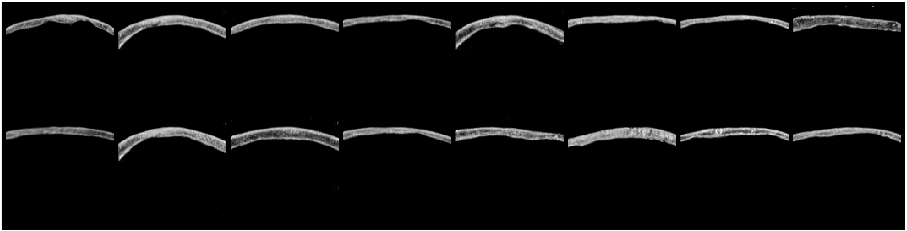

# SkullGAN

[Kasra Naftchi-Ardebili](https://bioengineering.stanford.edu/people/kasra-naftchi-ardebili)†, [Karanpartap Singh](https://karanps.com)†, Reza Pourabolghasem, Pejman Ghanouni, Gerald R. Popelka, [Kim Butts Pauly](https://kbplab.stanford.edu).

† denotes equal contribution.

**Stanford University, Schools of Engineering and Medicine**

<hr>



SkullGAN is a novel generative adversarial network (GAN) engineered for the generation of synthetic computed tomography (CT) slices of the human skull. It has been developed to address the prevalent bottleneck in machine learning healthcare applications - the scarcity of carefully curated medical images.

Preprint: [arXiv](https://arxiv.org/list/cs.AI/recent)

## Abstract

Machine learning holds substantial potential for diverse healthcare applications. Some applications involving the human skull include segmentation, reconstruction, anomaly detection, denoising, and transcranial focused ultrasound simulations. However, the broad adoption of deep learning for these uses necessitates large numbers of carefully curated medical images to train effective and generalizable models. 

Our solution, SkullGAN, addresses this problem by generating a vast dataset of synthetic CT slices of the human skull. The generated synthetic skulls were first validated based on three quantitative radiological features: skull density ratio (SDR), mean thickness, and mean intensity. However, we show that these metrics can be easily fooled and therefore evaluate SkullGAN-generated skull segments using t-distributed stochastic neighbor embedding (t-SNE) and ultimately by applying the trained discriminator of SkullGAN as a classifier. 

The results show that SkullGAN is capable of generating large numbers of synthetic skull CT segments that are visually and quantitatively indistinguishable from real skull CT segments, and therefore alleviates obstacles such as access, capital, time, and domain expertise in preparing high quality training datasets. SkullGAN makes it possible for any researcher to generate thousands of highly varied skull CT segments in a few minutes and at a very low cost, for training neural networks with medical applications that involve the human skull.

## Getting Started

SkullGAN was written in Python v3.9.2 using PyTorch v1.9.0. We've included two ways to train SkullGAN, one through the command-line (source code located in `cli/`), and one through a Jupyter notebook ('SkullGAN - Train.ipynb'). The Jupyter notebook is self-contained, and requires only that you have the necessary libraries and packages installed. Meanwhile, the command-line implementation is separated into three files: models, functions, and skullgan. All training code and hyperparameters can be edited in `skullgan.py`, and this file can be run through a command-line using `python3 skullgan.py`. The provided implementation will display progress bars to denote the current training progress, and save a batch of generated images to the disk after every epoch of training. Once the desired number of epochs have been reached, the trained model and a batch of 1,000 sample images will be saved to the disk. 

You can download both our pre-trained model (trained on 100,000 images from the Celeb-A dataset [[1]](https://mmlab.ie.cuhk.edu.hk/projects/CelebA.html)), and the final SkullGAN model presented in the paper at this link: [SkullGAN Model Files - PyTorch](https://drive.google.com/drive/folders/1KRLXFMssKKuQwXL5J9fVorhVGbZaSeK4?usp=sharing).

## Datasets

We will release our training dataset of anonymized human skull CTs within the coming weeks. 

## Citation

If you found SkullGAN helpful for your own research or applications, please cite it using the following BibTeX:
```bibtex
    @article{SkullGAN2023,
        title={SkullGAN: Synthetic Skull CT Generation with Generative Adversarial Networks},
        author={Kasra Naftchi-Ardebil, Karanpartap Singh, Reza Pourabolghasem, Pejman Ghanouni, Gerald R. Popelka, Kim Butts Pauly},
        journal={arXiv: },
        year={2023}
    }
```
